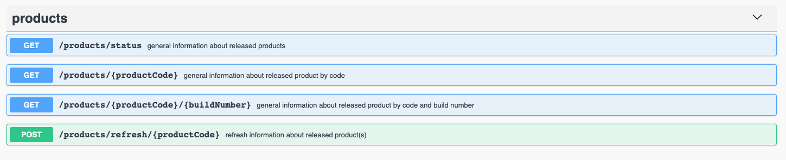
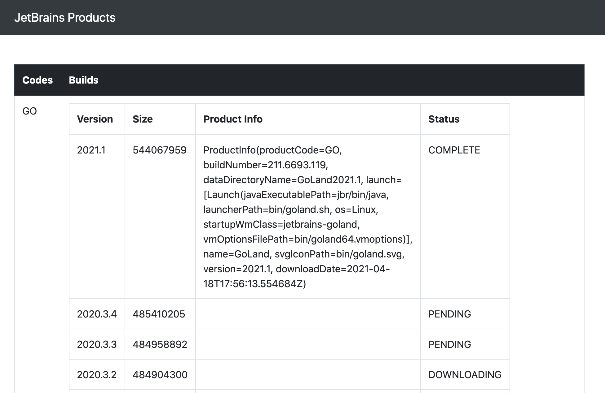

# Getting Started

### Reference Documentation

For further reference, please consider the following sections:

## Descripion

The goal of service is to provide general information about released products
This is a small demo project based on Spring Boot, Redis in Docker containers.

It runs a job every hour to extract products not yearly than 1 year and downoad product-info
for each extracted build. 
Task is running several parallel builds (3 by deafult, and can be configured)

This project requires java 11, Kotlin, Docker and Docker Compose, as it is compiled and run in containers.

Building and Running
--------------------
Build containers and run:

    docker-compose up -d

Verify that the app answers at <http://localhost:8080/products/status>

Stop containers:

    docker-compose down

API
--------------------
    path to spec: src/main/resources/openapi.yaml

UI
--------------------
Verify UI and check status of specific build at http://localhost:8080

